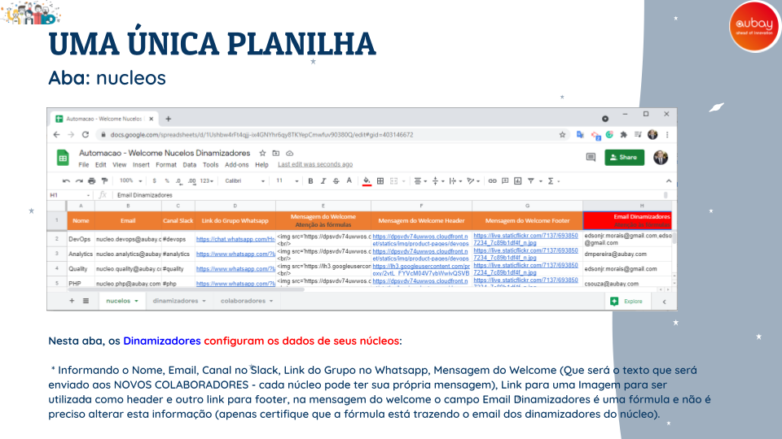
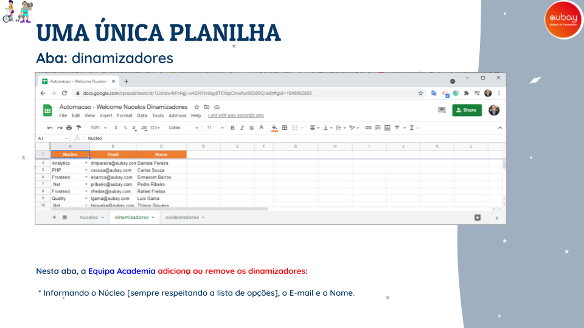
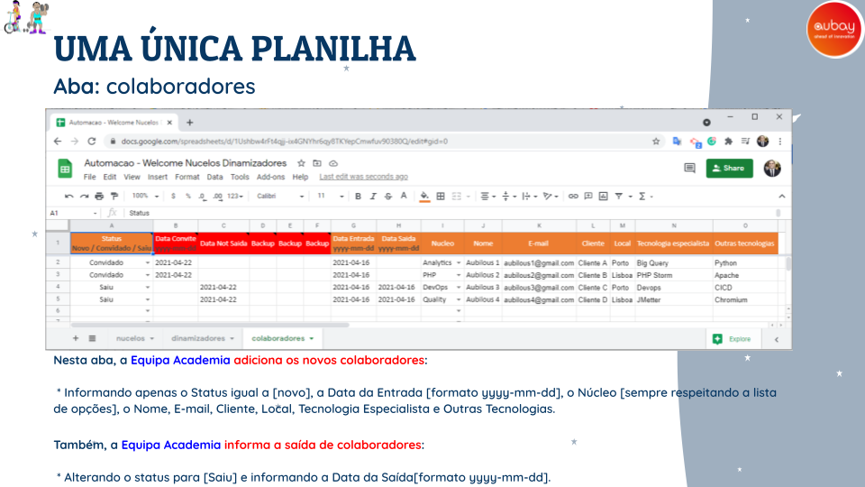
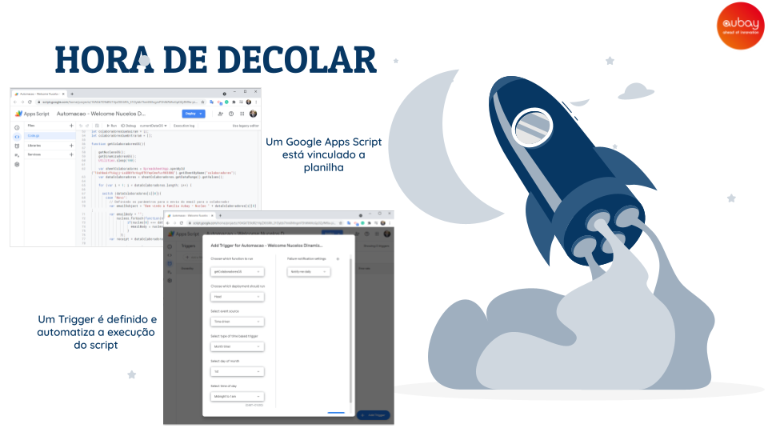
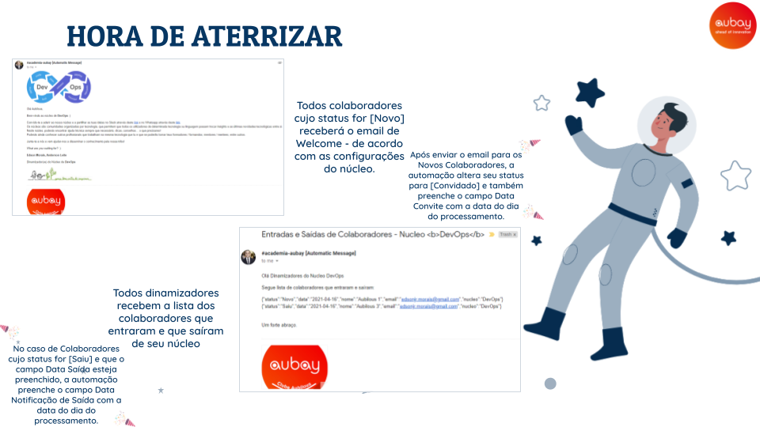
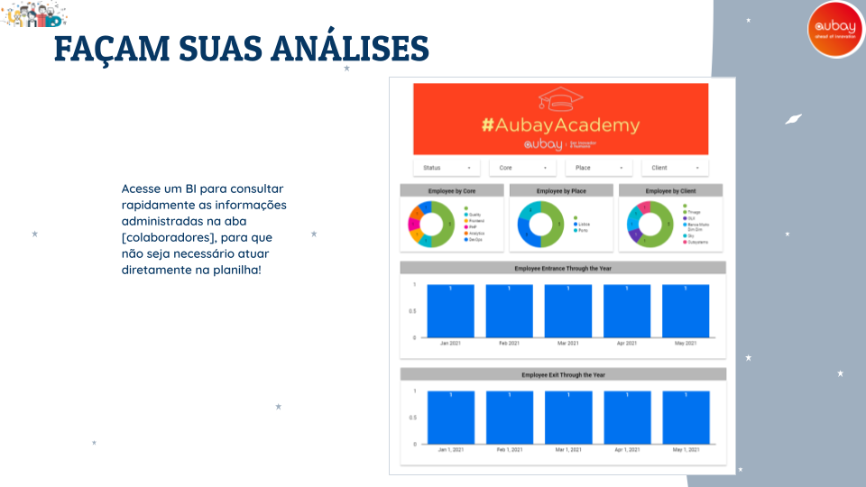

# Contextualização
Este projeto é baseado na solução Google GSuite, mais especificamente em Google Docs (Sheet) e Google Apps Script.

Os componentes deste projeto são 1 planilha (Google Sheet) e 1 script 'stand-alone' (Google Apps Script).

O planilha é utilizada como mecanismo para CRUD (Create, Retrieve, Update, Delete) e armazenamento dos dados.

O script é utilizado como mecanismo para automação do processo, baseado nos dados armazenados na planilha.

# Setup
* Crie uma conta Google.

* No Google Drive crie uma pasta chamada [Automacao - Welcome Nucelos Dinamizadores].

* Nesta pasta crie um Google Sheet com o nome [Automacao - Welcome Nucelos Dinamizadores].
* * Você deve garantir que esta planilha possua a mesma estrutura e fórmulas que a planilha armazenada neste repositório.

* Nesta pasta crie um Google Apps Script com o nome [Automacao - Welcome Nucelos Dinamizadores].
* * Neste Google Apps Script substitua o código do arquivo Code.gs, pelo código fonte armazenado no arquivo Code.gs deste repositório.
* * Neste código fonte, substitua a string @PutHereTheGoogleSheetID@ pelo ID do Google Sheet criado anteriormente.
* * Execute a função currentDateGS() [apenas para que o Google lhe apresente o processo de permissionamento de execução do script] e aceite o pedido de permissionamento.

* No Google Apps Script adicione um Trigger para a função getColaboradoresGS() com periodicidade de 1 dia e para ser processado às 00:00.

* No Google Data Studio crie um Data Source com o nome [Automacao - Welcome Nucelos Dinamizadores], onde a fonte de dados será a aba Colaboradores da planilha criada anteriormente. Em seguida crie um Report com o nome [Automacao - Welcome Nucelos Dinamizadores], onde os dados para apresentação é o Data Source criado anteriormente.

<b>Atenção:</b> 

1 - O nome da pasta, da planilha, do script, do data source, do report e periodicidade do trigger são totalmente sugestivos, eles não impactam no processamento da automação.

2 - O controle de acesso à planilha e ao BI é controlado conforme os e-mails inseridos na sessão Compartilhamento destes documentos.

# Orientações gerais e apresentação

